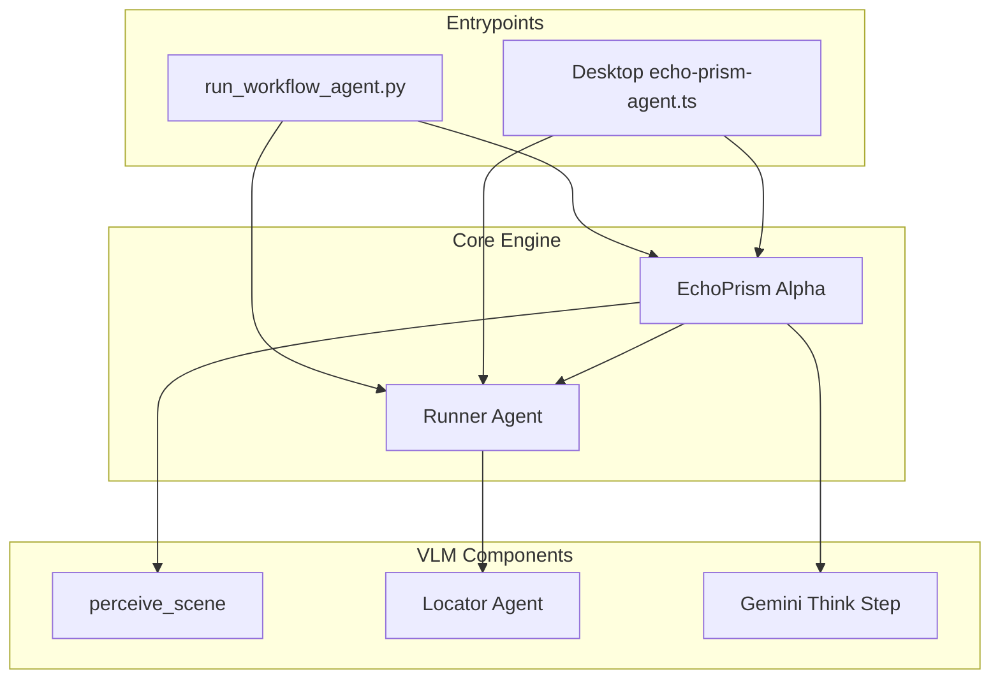
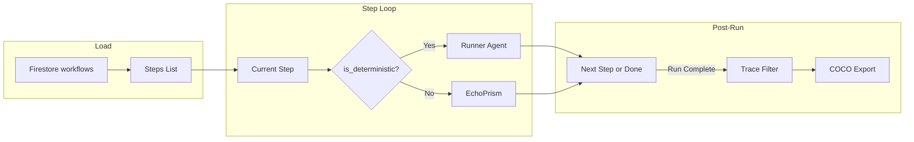
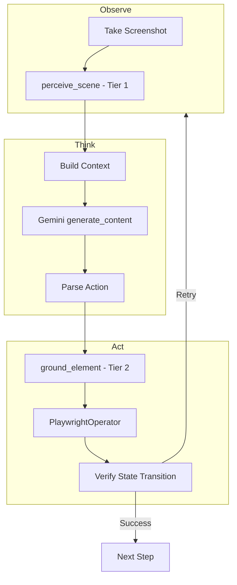
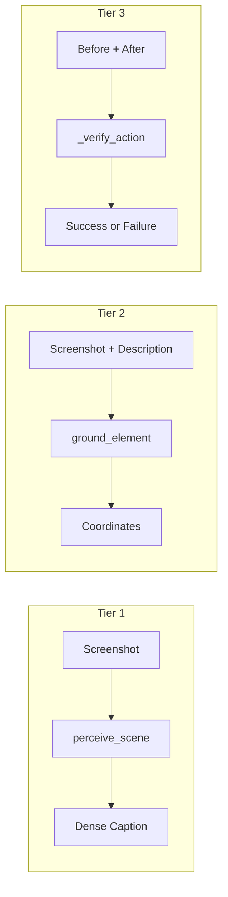
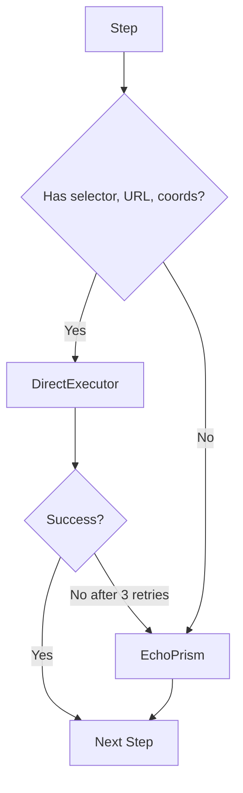

# Echo Agent Architecture

This document describes the architecture of the Echo workflow automation agent — how it executes workflows, how EchoPrism (the VLM-based agent) works, and how the subagents, training pipeline, and integrations fit together.

> **Tip:** To view Mermaid diagrams, use a Markdown preview that supports Mermaid (e.g. the [Mermaid](https://marketplace.visualstudio.com/items?itemName=bierner.markdown-mermaid) extension for VS Code/Cursor, or view on GitHub).

---

## Table of Contents

1. [High-Level Overview](#1-high-level-overview)
2. [Execution Flow](#2-execution-flow)
3. [EchoPrism: The Parent Agent](#3-echoprism-the-parent-agent)
4. [3-Tier VLM Perception Pipeline](#4-3-tier-vlm-perception-pipeline)
5. [Direct Executor vs. EchoPrism](#5-direct-executor-vs-echoprism)
6. [Subagents](#6-subagents)
7. [Training Pipeline](#7-training-pipeline)
8. [Integrations](#8-integrations)
9. [Model Configuration](#9-model-configuration)
10. [Data Flow and Firestore](#10-data-flow-and-firestore)
11. [File Structure Reference](#11-file-structure-reference)

---

## 1. High-Level Overview

The Echo agent automates workflows in browsers (and optionally desktop apps). Workflows are sequences of steps such as *navigate to URL*, *click the "Submit" button*, *type in the search box*, or *call the Slack API*. The agent decides *how* to perform each step using either:

- **Direct execution** — When a step has enough information (URL, selector, coordinates), it is executed deterministically via Playwright without calling an LLM.
- **EchoPrism** — When a step is ambiguous (e.g., "click the login button" with no selector), a vision-language model observes the screen, reasons about what to do, and executes actions.



---

## 2. Execution Flow

The main entrypoint is `run_workflow_agent.py`, which runs as a Cloud Run Job (or in-process for local dev). It loads a workflow from Firestore, iterates over steps, and for each step decides: deterministic → DirectExecutor, ambiguous → EchoPrism.



**Deterministic steps** are those that have:
- `url` (for navigate)
- `selector` (DOM selector)
- `x` and `y` coordinates
- `api_call` action
- Other fully specified params (e.g., `key` for press_key)

**Ambiguous steps** require EchoPrism: e.g., *"Click the blue Submit button"* with only a natural-language description.

---

## 3. EchoPrism: The Parent Agent

EchoPrism is a UI-TARS-style **Observe → Think → Act** agent. For each ambiguous step, it:

1. **Observe** — Takes a screenshot; optionally runs `perceive_scene` for a dense caption.
2. **Think** — Sends screenshot + instruction + history to Gemini; receives `Thought: ...` and `Action: ...`.
3. **Act** — Parses the action, grounds elements if needed (e.g., converts "the Submit button" to coordinates), executes via the Operator, verifies the outcome.



**Key behaviors:**
- Uses fine-tuned model from `global_model/current` in Firestore if available; else `gemini-3.1-pro-preview`.
- Maintains (o, t, a) history — observations, thoughts, actions — for multi-step context.
- Retries up to 3 times on parse failure or operator failure.
- Returns `"finished"` or `"calluser"` when the agent signals completion or needs human help.
- Uses context caching for the system prompt to reduce token cost.

---

## 4. 3-Tier VLM Perception Pipeline

EchoPrism uses a **pure VLM** pipeline: no DOM access, only screenshots. The pipeline has three tiers:

| Tier | Function | Purpose |
|------|----------|---------|
| **Tier 1** | `perceive_scene` | Dense caption of the full UI (layout, regions, elements). Used as `[Scene Overview]` in the instruction. |
| **Tier 2** | `ground_element` (Locator) | Given a natural-language description, returns center (x, y) and bounding box. Used for click-type actions. |
| **Tier 3** | `_verify_action` | Before/after screenshots + expected outcome → Gemini judges success. |

For medium-confidence grounding, EchoPrism uses **RegionFocus** (zoom into uncertain region, re-ground at higher resolution).



**Models:**
- Locator (element grounding) uses `LOCATOR_MODEL` (see `models_config.py`).
- Orchestration (Think step) uses `ORCHESTRATION_MODEL` (see `models_config.py`).

---

## 5. Direct Executor vs. EchoPrism

| Aspect | DirectExecutor | EchoPrism |
|--------|----------------|-----------|
| **Module** | `direct_executor.py` | `echo_prism/alpha/agent.py` |
| **LLM** | None | Gemini |
| **When used** | Steps with selector, URL, coords, or full params | Ambiguous steps (description only) |
| **Execution** | Playwright `page.click`, `page.fill`, etc. | Runner's PlaywrightOperator after Locator grounding |
| **Fallback** | If DirectExecutor fails after retries → hand off to EchoPrism | — |



---

## 6. Subagents

Subagents handle user-facing interactions, workflow creation, element localization, and execution.

| Agent | File | Purpose |
|-------|------|---------|
| **Chat** | `modalities/chat_agent.py` | Alpha's text modality. Function calling: list workflows, run, redirect, cancel, synthesize, integrations. |
| **Voice** | `modalities/voice_agent.py` | Alpha's voice modality. Gemini Live API; WebSocket bridge for TTS/STT. |
| **Synthesis** | `synthesis_agent.py` | Workflow creation from video/screenshots/description. |
| **Locator** | `locator_agent.py` | Element localization: screenshot + description → coords. Swappable model (e.g., UI-TARS). |
| **Runner** | `runner_agent.py` | Executes deterministic UI steps (Playwright) and api_call steps (integrations). Calls Locator when semantic actions need coords. |

See [subagents.md](../echo_prism/docs/subagents.md) and [synthesis-flow.md](synthesis-flow.md) for details.

---

## 7. Training Pipeline

The training pipeline improves EchoPrism over time using UI-TARS self-improvement.

1. **Trace Filter** — Rule-based scoring only (errors, duplicates, excessive waits, etc.); writes to `filtered_traces`.
2. **COCO Export** — Converts traces to COCO4GUI format for datasets.
3. **Vertex Export** — Builds JSONL, uploads to GCS, submits tuning job. Updates `global_model/current` when ready.

See [training.md](../echo_prism/docs/training.md) and [FINETUNING_README.md](../echo_prism/docs/FINETUNING_README.md).

---

## 8. Integrations

Integrations allow workflows to call external APIs (Slack, Gmail, GitHub, etc.) via `api_call` steps. The Runner agent executes api_call steps; each integration exposes an `execute(method, args, token)` function.

See [integrations.md](integrations.md).

---

## 9. Model Configuration

Models are configured via environment variables (see `echo_prism/models_config.py`):

| Component | Env Var | Default |
|-----------|---------|---------|
| Main Agent (Alpha) | `ECHOPRISM_ORCHESTRATION_MODEL` | gemini-2.5-flash |
| Locator | `ECHOPRISM_LOCATOR_MODEL` | gemini-2.5-flash |
| Synthesis (video + description) | `ECHOPRISM_SYNTHESIS_MODEL` | gemini-3.1-pro-preview |
| Voice | `ECHOPRISM_VOICE_MODEL` | gemini-2.5-flash-native-audio-preview-12-2025 |

---

## 10. Data Flow and Firestore

- **workflows** — Workflow metadata and steps.
- **runs** — Run status, logs (thought, action, step_index, screenshots).
- **filtered_traces** — Quality-scored traces for training.
- **global_model/current** — Fine-tuned model ID when Vertex job completes.

---

## 11. File Structure Reference

```
backend/agent/
├── run_workflow_agent.py     # CLI entrypoint; orchestrates Runner + EchoPrism Alpha
├── direct_executor.py        # Low-level deterministic UI execution (used by Runner)
├── screenshot_stream.py      # GCS screenshot upload for frontend
├── docs/                     # Documentation
│   ├── ARCHITECTURE.md       # This file
│   ├── synthesis-flow.md     # Recording → synthesis flow
│   ├── agent-overview.md     # Quick reference
│   └── integrations.md       # App connectors
├── echo_prism/
│   ├── models_config.py      # Model env vars
│   ├── docs/                 # EchoPrism docs
│   │   ├── echo-prism-overview.md
│   │   ├── alpha.md
│   │   ├── subagents.md
│   │   ├── utils.md
│   │   ├── datasets.md
│   │   ├── training.md
│   │   ├── voice_subagent.md
│   │   └── FINETUNING_README.md
│   ├── alpha/                # Parent agent
│   ├── subagents/
│   ├── training/
│   ├── datasets/
│   └── utils/
└── integrations/             # Slack, Gmail, GitHub, etc.
```
