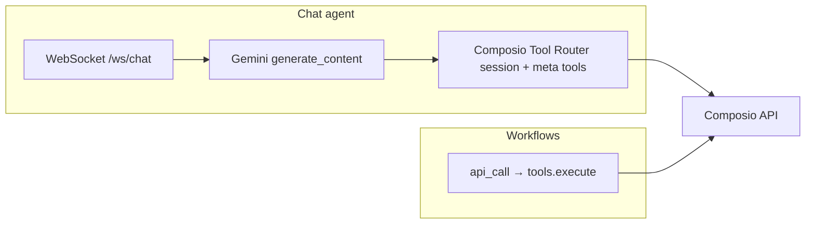

<!-- Improved compatibility of back to top link: See: https://github.com/othneildrew/Best-README-Template/pull/73 -->

<a id="readme-top"></a>

<!-- PROJECT SHIELDS -->

[![Contributors][contributors-shield]][contributors-url]
[![Forks][forks-shield]][forks-url]
[![Stargazers][stars-shield]][stars-url]
[![Issues][issues-shield]][issues-url]
[![MIT License][license-shield]][license-url]
[![LinkedIn][linkedin-shield]][linkedin-url]

<!-- PROJECT LOGO -->
<br />
<div align="center">
  <a href="https://github.com/JasonMun7/echo">
    
  </a>

<h3 align="center">Echo</h3>

  <p align="center">
    An AI-powered workflow automation platform — create, record, and run desktop & browser workflows using voice, chat, or visual recording, powered by the EchoPrism vision-language agent.
    <br />
    <a href="https://github.com/JasonMun7/echo"><strong>Explore the docs »</strong></a>
    <br />
    <br />
    <a href="https://echo-frontend-607073095974.us-central1.run.app">View Demo</a>
    &middot;
    <a href="https://github.com/JasonMun7/echo/issues/new?labels=bug&template=bug-report---.md">Report Bug</a>
    &middot;
    <a href="https://github.com/JasonMun7/echo/issues/new?labels=enhancement&template=feature-request---.md">Request Feature</a>
  </p>
</div>

<!-- TABLE OF CONTENTS -->
<details>
  <summary>Table of Contents</summary>
  <ol>
    <li>
      <a href="#about-the-project">About The Project</a>
      <ul>
        <li><a href="#architecture">Architecture</a></li>
        <li><a href="#agent-diagram">Agent Diagram</a></li>
        <li><a href="#built-with">Built With</a></li>
      </ul>
    </li>
    <li>
      <a href="#getting-started">Getting Started</a>
      <ul>
        <li><a href="#prerequisites">Prerequisites</a></li>
        <li><a href="#phase-1-gcp-setup">Phase 1: GCP Setup</a></li>
        <li><a href="#phase-2-firebase-setup">Phase 2: Firebase Setup</a></li>
        <li><a href="#phase-3-service-accounts--iam">Phase 3: IAM</a></li>
        <li><a href="#phase-4-gemini-api-key">Phase 4: Gemini API Key</a></li>
        <li><a href="#phase-5-local-development">Phase 5: Local Development</a></li>
        <li><a href="#phase-6-deploy-to-cloud-run">Phase 6: Deploy</a></li>
      </ul>
    </li>
    <li><a href="#usage">Usage</a></li>
    <li><a href="#roadmap">Roadmap</a></li>
    <li><a href="#contributing">Contributing</a></li>
    <li><a href="#license">License</a></li>
    <li><a href="#contact">Contact</a></li>
    <li><a href="#acknowledgments">Acknowledgments</a></li>
  </ol>
</details>

<!-- ABOUT THE PROJECT -->

## About The Project

[![Echo Dashboard Screenshot][product-screenshot]](https://echo-frontend-607073095974.us-central1.run.app)

**Echo** is an AI-powered workflow automation platform. Create and edit desktop and browser workflows (from recordings, voice, or chat), then run them via the **EchoPrism** vision-language agent — which executes steps (navigate, click, type, scroll) on your desktop. Use the **web dashboard** to manage workflows and runs, and the **Electron desktop app** for voice-driven control and running your workflows locally.

<p align="right">(<a href="#readme-top">back to top</a>)</p>

### Architecture

![Architecture Diagram][architecture-diagram]

<p align="right">(<a href="#readme-top">back to top</a>)</p>

### Agent Diagram

![Agent Diagram][agent-diagram]

<p align="right">(<a href="#readme-top">back to top</a>)</p>

### Built With

[![Next][Next.js]][Next-url]
[![React][React.js]][React-url]
[![Python][Python]][Python-url]
[![FastAPI][FastAPI]][FastAPI-url]
[![Firebase][Firebase]][Firebase-url]
[![Google Cloud][GoogleCloud]][GoogleCloud-url]
[![Electron][Electron]][Electron-url]
[![Docker][Docker]][Docker-url]

<p align="right">(<a href="#readme-top">back to top</a>)</p>

### EchoPrism chat: Composio v3 and workflows

- **Chat (Gemini + WebSocket)** uses the Composio **Tool Router** pattern: `composio.create(user_id=…)` with the **LangGraph** provider, **`session.tools()`** meta tools (`COMPOSIO_SEARCH_TOOLS`, `COMPOSIO_MULTI_EXECUTE_TOOL`, `COMPOSIO_MANAGE_CONNECTIONS`, …), and execution through those tools — not bulk `get_raw_composio_tools` in the agent loop. Toolkits allowed in chat follow `COMPOSIO_CHAT_TOOLKITS` (see `scripts/doppler-env-reference.md`).
- **Workflow `api_call` steps** continue to use Composio **`tools.execute`** (with optional `dangerously_skip_version_check`) for deterministic execution and HITL in the Run HUD; they do not require the chat Tool Router session path.



**Langfuse** (optional): chat turns, Composio execution, scores, and prompt labels — see `scripts/doppler-env-reference.md` (“Langfuse billing hygiene”). **Tests:** from `agent/`, `pytest` (fast PR gate); optional slow tests use `-m slow` when added.

<p align="right">(<a href="#readme-top">back to top</a>)</p>

<!-- GETTING STARTED -->

## Getting Started

To run the full stack locally or deploy from scratch, follow the phases below.

### Prerequisites

Install the following tools before proceeding:

- **Node.js** 18+ — [nodejs.org](https://nodejs.org) or `nvm install 18`
- **pnpm** — `npm install -g pnpm`
- **Python** 3.11+ — [python.org](https://www.python.org) or `pyenv install 3.11`
- **Docker** — for building and deploying images
- **gcloud CLI** — [Install guide](https://cloud.google.com/sdk/docs/install)
  ```sh
  gcloud auth login
  gcloud auth application-default login
  ```
- **Firebase CLI**
  ```sh
  npm install -g firebase-tools
  firebase login
  ```
- **Doppler** (optional but recommended) — for secrets management
  ```sh
  brew install dopplerhq/cli/doppler
  doppler login
  ```

### Composio (integrations)

Third-party OAuth for Slack, GitHub, and Google runs through **[Composio](https://composio.dev)** managed auth. Echo still uses **Firebase** for product login; Composio stores provider tokens keyed by Firebase `uid`.

1. Create a Composio project and add the toolkits you need (Composio manages default auth configs; no per-toolkit env IDs required for connect links).
2. On the **API server**, set `COMPOSIO_API_KEY`. Optional: `COMPOSIO_OAUTH_CALLBACK_URL` or `FRONTEND_ORIGIN` so OAuth can return to your app after `session.authorize`.
3. On the **Echo Prism agent**, set `COMPOSIO_API_KEY` (and optional `COMPOSIO_CHAT_TOOLKITS`, `COMPOSIO_CHAT_TOOL_LIMIT`) so workflow `api_call` steps execute tools.
4. Users open **Dashboard → Integrations** and connect each app; the UI calls `GET /api/composio/link?toolkit=…`.

Workflow `api_call` steps and chat tools use **Composio tool slugs** (`slug` + `arguments`); execution is Composio-only.

**Google APIs:** Convenience methods and `rest` / `google_rest` are documented in `echo_prism_agent/integrations/google.py` and scope groups in `google_scopes.py`. Enable matching APIs and OAuth scopes in Google Cloud and your Composio Google auth config.

Local backend: `pnpm run dev:backend` sets `PYTHONPATH=../agent` so integration modules load from `echo_prism_agent/integrations/`.

<p align="right">(<a href="#readme-top">back to top</a>)</p>

### Phase 1: GCP Setup

1. Go to [Google Cloud Console](https://console.cloud.google.com) and create or select a project with billing enabled.

2. In **APIs & Services → Enable APIs**, enable:
   - Cloud Run API
   - Cloud Scheduler API
   - Firestore API
   - Cloud Storage API
   - Gemini API

3. Go to **Cloud Storage → Buckets**, create a bucket with **Uniform bucket-level access**, and note the name (e.g. `echo-assets-prod`).

<p align="right">(<a href="#readme-top">back to top</a>)</p>

### Phase 2: Firebase Setup

1. Go to [Firebase Console](https://console.firebase.google.com) and create a new project or link your existing GCP project.

2. Enable authentication: **Authentication → Sign-in method** → enable **Email/Password** and **Google**.

3. Create Firestore: **Firestore Database → Create database** → choose **Native mode**.

4. Register your web app: **Project Settings → Your apps → Add web app (</>)** and copy the config object.

5. Deploy Firestore rules from the project root:
   ```sh
   cd firebase && firebase deploy --only firestore:rules
   ```

<p align="right">(<a href="#readme-top">back to top</a>)</p>

### Phase 3: Service Accounts & IAM

Use the default compute service account for Cloud Run and ensure it has:

- **Firestore**: Cloud Datastore User (or Firestore roles)
- **Storage**: Storage Object Admin
- **Cloud Run Jobs**: Run Jobs Executor

<p align="right">(<a href="#readme-top">back to top</a>)</p>

### Phase 4: Gemini API Key

1. Go to [Google AI Studio](https://aistudio.google.com/apikey)
2. Sign in, select your GCP project, and create an API key
3. Copy the key — you'll need it for `GEMINI_API_KEY`

<p align="right">(<a href="#readme-top">back to top</a>)</p>

### Phase 5: Local Development

**Clone and install:**

```sh
git clone https://github.com/JasonMun7/echo.git
cd echo
pnpm install
pnpm run install:backend
```

**Option A: Doppler (recommended)**

```sh
doppler setup   # select project and dev config
```

Then run each service in a separate terminal:

```sh
# Terminal 1 – backend
pnpm run dev:backend

# Terminal 2 – frontend
pnpm run dev

# Terminal 3 – desktop app
pnpm run dev:desktop

# Terminal 4 – Echo Prism agent (LangGraph + OpenRouter + Gemini; `agent/`)
pnpm run dev:agent

# Terminal 5 – LiveKit voice worker (optional; run from repo root so `agent.*` imports resolve)
pnpm run dev:livekit-agent
```

Set `NEXT_PUBLIC_ECHO_AGENT_URL` (web) and `VITE_ECHO_AGENT_URL` (desktop) to `http://localhost:8083` in Doppler for local agent access. Set `OPENROUTER_API_KEY` for GUI inference (Kimi + muscle-mem); override with `ECHOPRISM_MUSCLE_MODEL` if needed. Install the sibling package: from `agent/` run `pip install -e ../muscle-mem-agent` (required for the Worker, semantic verification, and tool registry). See [agent/echo_prism_agent/muscle/MUSCLE_MIGRATION.md](agent/echo_prism_agent/muscle/MUSCLE_MIGRATION.md) for the migration map.

**Option B: .env files**

```sh
# Web app
cd apps/web && cp .env.local.example .env.local
# Edit .env.local with Firebase config and NEXT_PUBLIC_API_URL=http://localhost:8000

# Backend
cd backend && cp .env.example .env
# Edit .env with ECHO_GCP_PROJECT_ID, ECHO_GCS_BUCKET, GEMINI_API_KEY
```

**Local URLs:**

- Frontend: [http://localhost:3000](http://localhost:3000)
- Backend: [http://localhost:8000](http://localhost:8000)
- Echo Prism agent: [http://localhost:8083](http://localhost:8083)

**Environment Variables Reference:**

| Variable                     | Required    | Description                                    |
| ---------------------------- | ----------- | ---------------------------------------------- |
| `ECHO_GCP_PROJECT_ID`        | Yes         | GCP project ID                                 |
| `ECHO_GCS_BUCKET`            | Yes         | GCS bucket name                                |
| `GEMINI_API_KEY`             | Yes         | Gemini API key                                 |
| `NEXT_PUBLIC_API_URL`        | Yes         | Backend URL (web)                              |
| `NEXT_PUBLIC_ECHO_AGENT_URL` | Yes         | Echo Prism agent URL (web)                     |
| `NEXT_PUBLIC_FIREBASE_*`     | Yes         | Firebase config (web)                          |
| `VITE_API_URL`               | Yes         | Backend URL (desktop)                          |
| `VITE_ECHO_AGENT_URL`        | Yes         | Echo Prism agent URL (desktop)                 |
| `OPENROUTER_API_KEY`         | Recommended | OpenRouter key for LangGraph/UI-Tars inference |
| `LIVEKIT_URL`                | Voice only  | LiveKit server URL                             |
| `LIVEKIT_API_KEY`            | Voice only  | LiveKit API key                                |
| `LIVEKIT_API_SECRET`         | Voice only  | LiveKit API secret                             |
| `ECHO_CLOUD_RUN_REGION`      | No          | Default `us-central1`                          |

See [scripts/doppler-env-reference.md](scripts/doppler-env-reference.md) for the full reference.

<p align="right">(<a href="#readme-top">back to top</a>)</p>

### Phase 6: Deploy to Cloud Run

```sh
pnpm run deploy
# or with explicit env:
GEMINI_API_KEY=your-key ECHO_GCS_BUCKET=your-bucket \
  ./scripts/deploy.sh YOUR_GCP_PROJECT_ID us-central1
```

The script builds and pushes Docker images, deploys frontend and backend as Cloud Run services, and deploys the Echo Prism agent (LangGraph) to Cloud Run (`pnpm run deploy:agent`).

**To deploy the LiveKit voice worker (optional):**

```sh
pnpm run deploy:livekit-agent
```

Requires `LIVEKIT_URL`, `LIVEKIT_API_KEY`, `LIVEKIT_API_SECRET`, `LIVEKIT_AGENT_SECRET`, `ECHOPRISM_AGENT_URL`, and `GEMINI_API_KEY`.

**Forks:** use your GCP project and ensure Doppler **prd** includes `NEXT_PUBLIC_FIREBASE_*` (and optional desktop download URLs) so the full deploy builds a complete web image. See [scripts/deploy/README.md](scripts/deploy/README.md) and [scripts/doppler-env-reference.md](scripts/doppler-env-reference.md) (section _Fork / alternate GitHub_).

<p align="right">(<a href="#readme-top">back to top</a>)</p>

<!-- USAGE EXAMPLES -->

## Usage

Visit the [live demo](https://echo-frontend-607073095974.us-central1.run.app) to check out our web app. Make sure to follow the instructions in our [releases](https://github.com/JasonMun7/Echo/releases) page to ensure the desktop app can be ran.

1. **Create a workflow** — record a screen capture, describe steps via chat, or use voice on the desktop app
2. **Edit steps** — review and modify the auto-generated workflow steps in the dashboard
3. **Run** — trigger a run from the desktop app; EchoPrism executes each step via vision-language grounding
4. **Monitor** — watch the execution and click Ctrl + Shift + V to interrupt for user steering

<p align="right">(<a href="#readme-top">back to top</a>)</p>

<!-- ROADMAP -->

## Roadmap

- [ ] **Mobile app automation** — Allow Echo to automate tasks on phones as well
- [ ] **Fine tuning** — Improve model accuracy by training on user data with Vertex AI
- [ ] **Expanded integrations** — Add third-party app connectors like Slack, Notion, and G-Suite
- [ ] **Workflow marketplace** — Create a library of community-shared automations users can install and customize
- [ ] **Schedule workflows** — Allow users to schedule workflows to run at specific times
- [ ] **Reduce costs** — Optimize OpenRouter / Gemini calls for vision steps

See the [open issues](https://github.com/JasonMun7/echo/issues) for a full list of proposed features and known issues.

<p align="right">(<a href="#readme-top">back to top</a>)</p>

<!-- CONTRIBUTING -->

## Contributing

Contributions are what make the open source community such an amazing place to learn, inspire, and create. Any contributions you make are **greatly appreciated**.

If you have a suggestion that would make this better, please fork the repo and create a pull request. You can also open an issue with the tag "enhancement".
Don't forget to give the project a star!

1. Fork the Project
2. Create your Feature Branch (`git checkout -b feature/AmazingFeature`)
3. Commit your Changes (`git commit -m 'Add some AmazingFeature'`)
4. Push to the Branch (`git push origin feature/AmazingFeature`)
5. Open a Pull Request

<p align="right">(<a href="#readme-top">back to top</a>)</p>

### Top Contributors

<a href="https://github.com/JasonMun7/echo/graphs/contributors">
  
</a>

<!-- LICENSE -->

## License

Distributed under the MIT License. See `LICENSE.txt` for more information.

<p align="right">(<a href="#readme-top">back to top</a>)</p>

<!-- CONTACT -->

## Contact

**Jason Mun** — jason.mun484@gmail.com · [LinkedIn](https://www.linkedin.com/in/jason-mun-25181b1b9/)

**Andrew Cheung** — andrewcheung360@gmail.com · [LinkedIn](https://www.linkedin.com/in/andrewcheung360/)

Project Link: [https://github.com/JasonMun7/echo](https://github.com/JasonMun7/echo)

<p align="right">(<a href="#readme-top">back to top</a>)</p>

<!-- ACKNOWLEDGMENTS -->

## Acknowledgments

- [OpenRouter](https://openrouter.ai/) — UI-Tars–compatible models for LangGraph inference
- [LiveKit](https://livekit.io) — Real-time voice and video infrastructure
- [Gemini](https://deepmind.google/technologies/gemini/) — Vision-language model powering EchoPrism
- [UI-TARS](https://github.com/bytedance/UI-TARS) — GUI agent model for automated UI interaction
- [Best-README-Template](https://github.com/othneildrew/Best-README-Template)

<p align="right">(<a href="#readme-top">back to top</a>)</p>

<!-- MARKDOWN LINKS & IMAGES -->

[contributors-shield]: https://img.shields.io/github/contributors/JasonMun7/echo.svg?style=for-the-badge
[contributors-url]: https://github.com/JasonMun7/echo/graphs/contributors
[forks-shield]: https://img.shields.io/github/forks/JasonMun7/echo.svg?style=for-the-badge
[forks-url]: https://github.com/JasonMun7/echo/network/members
[stars-shield]: https://img.shields.io/github/stars/JasonMun7/echo.svg?style=for-the-badge
[stars-url]: https://github.com/JasonMun7/echo/stargazers
[issues-shield]: https://img.shields.io/github/issues/JasonMun7/echo.svg?style=for-the-badge
[issues-url]: https://github.com/JasonMun7/echo/issues
[license-shield]: https://img.shields.io/github/license/JasonMun7/echo.svg?style=for-the-badge
[license-url]: https://github.com/JasonMun7/echo/blob/main/LICENSE.txt
[linkedin-shield]: https://img.shields.io/badge/-LinkedIn-black.svg?style=for-the-badge&logo=linkedin&colorB=555
[linkedin-url]: https://www.linkedin.com/in/jason-mun-25181b1b9/
[product-screenshot]: apps/web/public/dashboard-screenshot.png
[architecture-diagram]: architecture-diagram.png
[agent-diagram]: agent-diagram.png
[Next.js]: https://img.shields.io/badge/next.js-000000?style=for-the-badge&logo=nextdotjs&logoColor=white
[Next-url]: https://nextjs.org/
[React.js]: https://img.shields.io/badge/React-20232A?style=for-the-badge&logo=react&logoColor=61DAFB
[React-url]: https://reactjs.org/
[Python]: https://img.shields.io/badge/Python-3776AB?style=for-the-badge&logo=python&logoColor=white
[Python-url]: https://www.python.org/
[FastAPI]: https://img.shields.io/badge/FastAPI-005571?style=for-the-badge&logo=fastapi
[FastAPI-url]: https://fastapi.tiangolo.com/
[Firebase]: https://img.shields.io/badge/Firebase-039BE5?style=for-the-badge&logo=Firebase&logoColor=white
[Firebase-url]: https://firebase.google.com/
[GoogleCloud]: https://img.shields.io/badge/Google_Cloud-4285F4?style=for-the-badge&logo=google-cloud&logoColor=white
[GoogleCloud-url]: https://cloud.google.com/
[Electron]: https://img.shields.io/badge/Electron-191970?style=for-the-badge&logo=Electron&logoColor=white
[Electron-url]: https://www.electronjs.org/
[Docker]: https://img.shields.io/badge/docker-%230db7ed.svg?style=for-the-badge&logo=docker&logoColor=white
[Docker-url]: https://www.docker.com/
