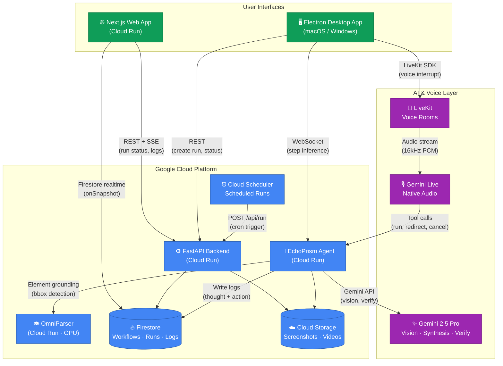

# Echo — System Architecture

Echo is a **Live AI Agent + UI Navigator** platform. Users record or describe workflows once; EchoPrism executes them autonomously using Gemini vision, OmniParser element grounding, and LiveKit voice — all hosted on Google Cloud.

---

## Architecture Diagram



---

## Component Descriptions

| Component | Technology | Role |
|---|---|---|
| **Web App** | Next.js 16, React 19, Tailwind | Dashboard: manage workflows, view run logs, share, voice agent |
| **Desktop App** | Electron + Vite | Capture screen, execute actions (Playwright/NutJS), connect to agent |
| **Backend API** | FastAPI, Firebase Admin | CRUD for workflows/runs, SSE streaming, scheduling, integrations |
| **EchoPrism Agent** | FastAPI, Gemini SDK | Step inference via vision, verification, Firestore log writes |
| **OmniParser** | YOLO + Florence-2, GPU | Detect UI elements with bounding boxes for precise grounding |
| **Firestore** | Google Cloud Firestore | Real-time sync for run status, thought/action logs, workflow data |
| **Cloud Storage** | Google Cloud Storage | Screenshots, synthesis videos, workflow thumbnails |
| **Gemini 2.5 Pro** | Google GenAI SDK | Vision inference, workflow synthesis from video, state verification |
| **Gemini Live** | LiveKit Agents + Gemini | Native audio voice agent: listen, respond, and call tools in real time |
| **LiveKit** | LiveKit Cloud | WebRTC rooms for low-latency voice interrupt sessions |
| **Cloud Scheduler** | Google Cloud Scheduler | OIDC-authenticated cron triggers for scheduled workflow runs |

---

## Key Data Flows

### Workflow Execution (Real-time)
```
Desktop App
  → captures screenshot
  → sends to EchoPrism Agent (WebSocket)
  → Agent calls Gemini 2.5 Pro (vision) + OmniParser (grounding)
  → Agent returns action (Click, Type, Navigate, etc.)
  → Agent writes {thought, action} to Firestore logs
  → Desktop executes action (Playwright/NutJS)
  → Web App receives log updates in real time (Firestore onSnapshot + SSE)
```

### Voice Interrupt
```
User speaks (mic)
  → LiveKit room captures audio
  → Gemini Live processes speech in real time
  → Tool call: redirect_run(instruction) or cancel_run()
  → EchoPrism Agent receives instruction
  → Desktop modifies current workflow steps
  → Run continues with updated context
```

### Workflow Synthesis
```
User records screen (video) or takes screenshots
  → Upload to Cloud Storage
  → Pass to Gemini Files API
  → synthesize_workflow_from_media() → JSON steps
  → Steps saved to Firestore
  → Workflow ready to run
```

---

## Google Cloud Services Used

- **Cloud Run** — Web App, Backend API, EchoPrism Agent, OmniParser (GPU)
- **Cloud Firestore** — Primary database (workflows, runs, logs, users, integrations)
- **Cloud Storage** — Media storage (screenshots, videos, thumbnails)
- **Cloud Scheduler** — Cron-based workflow execution
- **Vertex AI / Gemini API** — Vision, synthesis, audio models
- **Firebase Auth** — User authentication (Google OAuth + email)
- **Cloud Build** — CI/CD for parallel image builds and deployments
